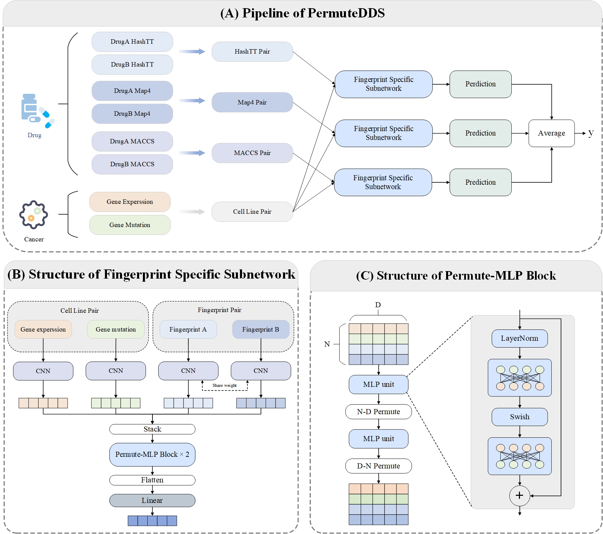

## PermuteDDS
The official implementation of our paper:  
PermuteDDS: A permutable feature fusion network for Drug-Drug Synergy prediction. PermuteDDS utilizes a permutable 
fusion mechanism to combine the drug and cell line features by integrating information of different channels, 
enabling the utilization of complex relationships between drugs and cell lines.



## Folder Specification
* Data/: the two dataset used for training and evaluation
* map4.py: the official implementation from [Reymond Research Group](https://github.com/reymond-group/map4)
* optimizer.py: the implementation of Adan optimizer
* permuteDDS.yaml: the required environment of PermuteDDS
* model.py: the implementation of PermuteDDS model
* utils.py: the implementation of data processing, calculate fingerprints and save results
* metrics.py: the implementation of model evaluation methods


## Requirements
* python: 3.7
* pytorch: 1.11
* rdkit: 2020.09.1
* numpy: 1.18
* tmap: 1.0

## Run the code
Setup with Conda. 
```
conda env export > permuteDDS.yaml
```
Select the dataset in main.py
```
dataset_name = 'ONEIL'  # ONEIL or ALMANAC
```
Run the code
```
python main.py
```